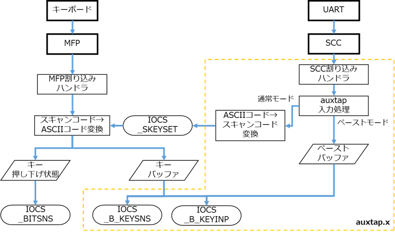

auxtap 補足ドキュメント
=======================

## 内部処理

以下の図は、X680x0 のキーボード入力に対して auxtap がどのように入力を生成しているかを示しています。

通常、キーボードからのキー入力は MFP の割り込みハンドラで受信されて、スキャンコードから ASCII コードに変換後、スキャンコード + ASCII コードの組としてキーバッファに入れられます。
IOCS _B_KEYINP や IOCS _B_KEYSNS が呼び出されると、キーバッファ内の入力がアプリケーションに渡されます。

auxtap は、SCC の割り込みハンドラで受信した UART からの入力を ASCII コードとして対応するスキャンコードに逆変換を行い、IOCS _SKEYSET によって通常のキー入力と同じように入力をキーバッファに入れます。

ここで、入力が 2 バイト文字だった場合やキーバッファに収まらないサイズのテキストが一度に入力された場合、ペーストモードに移行して、入力を ASCII コードのまま専用のペーストバッファに格納します。
ペーストモードではペーストバッファのASCIIコードをそのまま X68k 側の入力 (IOCS _B_KEYINP などの入力値) に渡します。スキャンコードは $00 になります。

ペーストした文字列がすべてアプリケーションに引き取られてペーストバッファが空になると、ペーストモードが解除されて通常の入力モードに戻ります。
ペーストモードでの入力中にシリアルポートから ESC キーを入力すると、ペーストがキャンセルされてペーストバッファが空になります。

## ビルド方法

ビルドには [elf2x68k](https://github.com/yunkya2/elf2x68k) を使用します。
ツールチェインにパスが通った状態で `make` を実行するとコンパイルして `auxtap.x` が生成されます。
