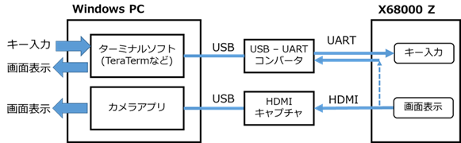
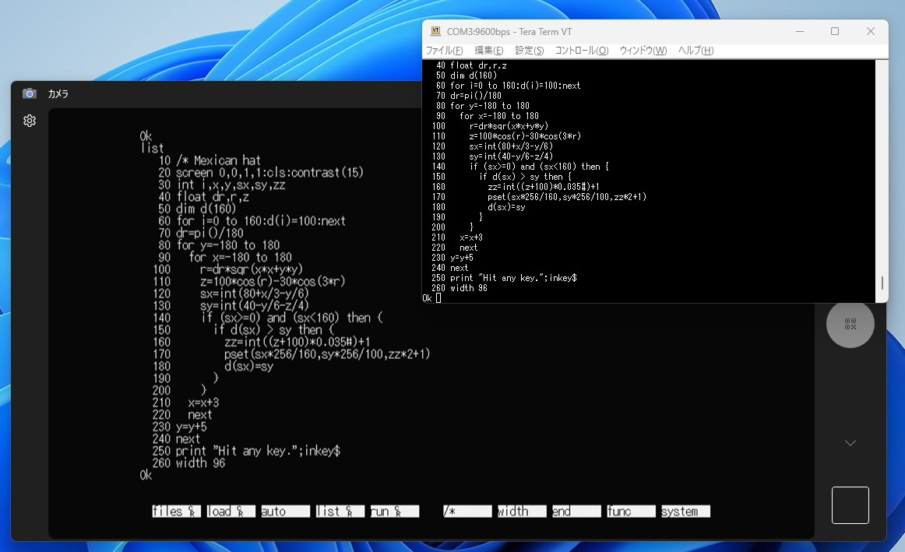

auxtap - X680x0 シリアルポートからコンソール入出力を行う
========================================================

## 概要

X680x0 のシリアルポート入出力で、キーボード入力や画面表示を置き換えるためのツールです。
以下のような機能があります。

* シリアルポートからの入力をキーボードから入力されたものとして扱います
  * 例えば、シリアルポートから文字 'A' を入力すると、キーボードの 'A' キーを押した + 離したというキースキャンコードを発生させます
  * シリアルポートから入力した日本語(シフトJISコード)は、そのまま X680x0 への日本語入力となります。ASK68K などが組み込まれていない状態でも、ターミナルソフトから日本語入力が可能になります
  * 入力文字列からスキャンコードへの変換規則を設定ファイルで変更可能です。CTRL+OPT.1+DEL のような該当する文字コードが存在しない特殊なキー操作を、ターミナルソフトが出力するエスケープシーケンスに割り当てることができます
* 画面への文字出力をシリアルポートにも合わせて出力します
  * キー入力の変換と合わせて用いることで、X680x0 と シリアルポートで接続された PC との間でテキストのコピー&ペーストが可能になります
  * リダイレクト等でのログ取得が行えない X-BASIC などについても、シリアルポートを用いてのログ取得が可能になります
  * シリアル出力によって文字表示が遅くなるのを防ぐため、使用中のキー操作でシリアルポートへの出力あり・なしを切り替えて必要なときだけ出力することができます

Windows で X68000 Z のクロス開発を行う場合に、X68000 Z の画面表示やキー入力を Windows 上から行いたいという用途を想定していますが、X680x0 実機でも使用できます。

## 使い方

auxtap.x と auxtap.cnf を同じディレクトリに配置して、auxtap.x を実行することで常駐します。

  * シリアルポートからの入力をキー入力に変換するようになります
  * 常駐している間はシリアルポートのデータ受信割り込みを auxtap が乗っ取るため、通常のシリアル入力 (IOCS _INP232C など) は動作しなくなります

### コマンドラインオプション

以下のオプションが指定できます

* `-s<baud>`
  * シリアルポートの通信速度を指定します。指定を省略すると、SRAM に設定されているデフォルトの通信速度を使用します
  * 通信速度以外のパラメータは 8ビットデータ、パリティなし、ストップビット1ビット、フロー制御なし で設定されます
  * 通信速度が速すぎると、カーソルキー等のキーリピートの際や大量のテキストを X68k 側にペーストする場合などにシリアルからの入力を一部取りこぼす可能性があります。X68000 Z (10MHz) の場合は 9600bps 程度にしておくと安全です。
* `-s<paste buffer size>`
  * テキストのペーストで用いられるペーストバッファのサイズをバイト単位で指定します。デフォルトは 65536 バイトです
* `-c`
  * 通常、常駐時はシリアルポートへの文字出力は無効になっていて、キー操作 (デフォルト設定では F12 キー) で有効になりますが、このオプションを指定すると常駐時からシリアルポートへの文字出力が有効になります
* `-r`
  * auxtap の常駐を解除します
  * 乗っ取っていたシリアルポートのデータ受信割り込みを元に戻します

### ターミナルソフトの設定

X68k 側へのキー入力やターミナルとの間でのコピー&ペーストが正常に機能するためには、シリアルポートに接続するターミナルソフトの設定が適切に行われている必要があります。
Windows の TeraTerm を例に、設定内容を示します。

* TeraTerm: 端末の設定 (設定(S) - 端末(T))
  * 改行コード
    * 受信(R)、送信(S)ともに `CR` を設定
  * 漢字-受信(K), 漢字-送信(J)
    * 文字コードには `SJIS` を設定
* TeraTerm: キーボードの設定 (設定(S) - キーボード(K))
  * DELを送信するキー
    * `Deleteキー` を設定
* TeraTerm: シリアルポート設定と接続 (設定(S) - シリアルポート(E))
  * スピード(E)
    * X68k 側の通信速度に合わせて設定
  * フロー制御(F)
    * `none` を設定
    * (Xon/Xoffを選択すると、表示中のCTRL+S, CTRL+Qのキー入力で画面とシリアルポートの表示がずれてしまいます)

## キー設定

### デフォルト設定

添付の設定ファイル `auxtap.cnf` には、ターミナルソフトに TeraTerm を用いた場合を想定したエスケープシーケンスからキーコードへの変換規則が定義されています。

通常の文字コードを発生させるキー入力に加えて、以下のような特殊なキー操作が定義されています。

キー操作          |X680x0 側に入力されるキーコード
------------------|------------------------------------------------------
F1 ～ F10         |F1 ～ F10
F11               |CTRL+↑
F12               |文字出力のシリアルポートへの出力有無の切り替え
Shift+F3          |CTRL+↑
Shift+F4          |CTRL+↓
Shift+F5          |文字出力のシリアルポートへの出力開始
Shift+F6          |文字出力のシリアルポートへの出力停止
Shift+F10         |CTRL+OPT.1+DEL
Shift+Tab         |CTRL+XF1
Ctrl+Space        |ESC - SPACE
Insert,Delete,Home|INS,DEL,HOME
End               |CLR
Page Up           |ROLL DOWN
Page Down         |ROLL UP

* condrv に `-oc` オプション(CTRLキーをウィンドウ操作キーにする)を付けて先に常駐させておくことで、F11, Shift+F3, Shift+F4 によってバックログが表示されます
* MicroEmacs は ESC - SPACE に set-mark コマンドが定義されていますが、オリジナルの Emacs 同様に Ctrl+Space で set-mark が動作します

### 設定ファイル auxtap.cnf

* 設定ファイル `auxtap.cnf` を編集することで、キースキャンコードへの変換規則を変更できます
* ファイルは 1 行に 1 エントリの構成で、`<入力文字列>` `<スキャンコード列>` の組を記述します。`#` で始まる行はコメントとして無視されます
  * `<入力文字列>` で `\x` で始まる16進数は、その値の1バイト文字として解釈されます
  * `<スキャンコード列>` には、X680x0 側に入力されるスキャンコードを16進数で指定します
    * スキャンコードを複数指定した場合は、前から順番にそのキーを押す + 離すの順でコードが送られます
    * スキャンコードの後ろに `+` を付けると、そのキーを押したままで次のコードが送られます。ここで押されたキーは、キー入力後 10ms 以上経過すると離すスキャンコードが送られます

#### 変換規則の指定例
```
\x00        01 35         # CTRL+SPACE -> ESC+SPACE
\x1b[34~    71+ 72+ 37    # SHIFT+F10 -> CTRL+OPT.1+DEL
```
* 入力文字列 `0x00` (CTRL+SPACEの入力で送られる文字コード) は、スキャンコード $01 (ESC) を押す、離す → $35 (SPACE) を押す、離す の順に変換されます
* 入力文字列 `0x1b [ 3 4 ~` (SHIFT+F10の入力で送られる文字コード) は、スキャンコード $71 (CTRL) を押す → $72 (OPT.1) を押す → $37 (DEL) を押す、離す の順に変換されます

## 接続例

X68000 Z の画面表示とキー入力を Windows PC から行うための接続例を示します。


(https://github.com/yunkya2/auxtap/blob/main/image/auxtap.png)

このように接続して X68000Z 上で auxtap.x を実行しておくと、Windows のカメラアプリで X68000Z の画面を表示させつつ、TeraTerm からのキー入力や表示のコピー&ペーストを行うような使い方ができます。

起動ドライブの `AUTOEXEC.BAT` で `auxtap.x` を実行するようにしておけば、キーボードに一切触らずに X68000Z を操作できます。



## 補足ドキュメント

auxtap.x のビルド方法や内部処理については、[補足ドキュメント](Internal.md) (https://github.com/yunkya2/auxtap/blob/main/Internal.md) を参照してください。

## ライセンス

MIT ライセンス
